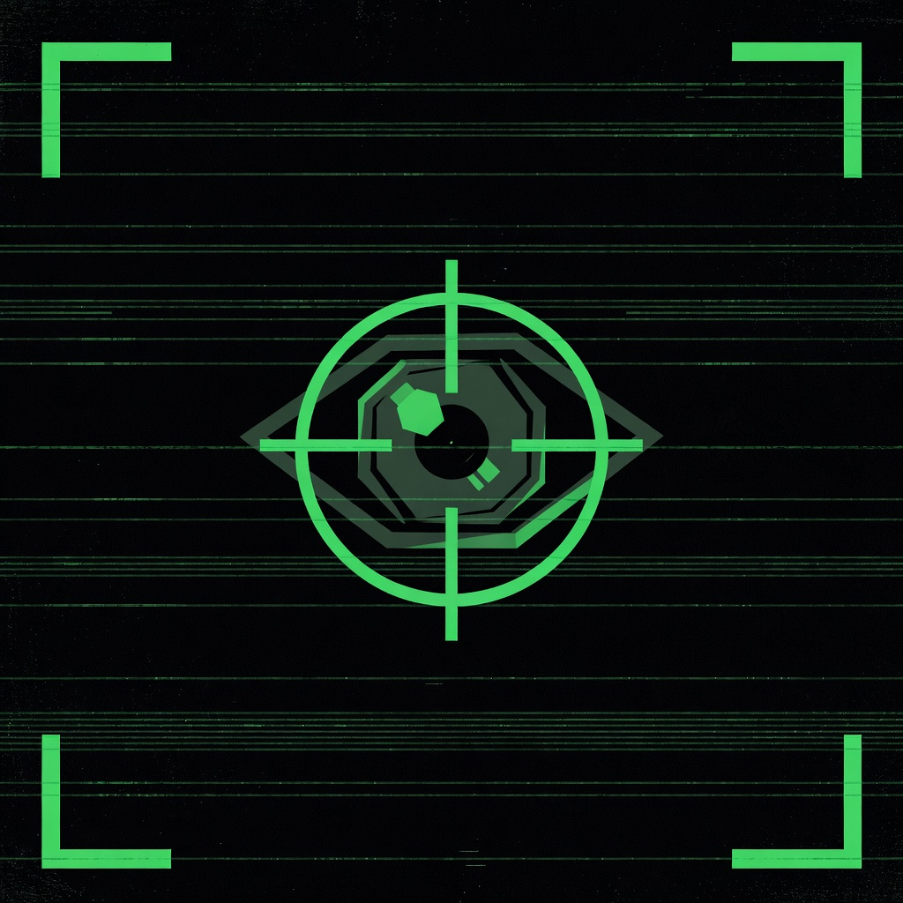

# CREEPER v1.0

A real-time webcam surveillance HUD that uses AI-powered body detection to classify what it sees and respond with audio alerts. Built for macOS Apple Silicon.

---

## What It Does

Creeper opens your webcam and overlays a sci-fi HUD on the live feed. It runs NudeNet body detection in a background thread and reacts to three tiers of detection:

| Detection | Visual | Audio |
|---|---|---|
| Face present | Status bar turns green: `HUMAN DETECTED` | `human_detected.mp3` |
| Belly exposed | Animated red targeting box with crosshair | `target_acquired.mp3` |
| Sensitive content | Region pixelated + thin border | `alert.mp3` |

The HUD includes corner brackets, a live timestamp, scrolling hex values, a status bar, and a visible scan line sweep.

---

## Requirements

- macOS (Apple Silicon M1/M2/M3/M4)
- Python 3.11
- A webcam (built-in or external)

---

## Setup

### 1. Confirm Python 3.11

```bash
python3.11 --version
```

If missing:

```bash
brew install python@3.11
```

### 2. Create and activate a virtual environment

```bash
python3.11 -m venv .venv
source .venv/bin/activate
```

### 3. Install dependencies

```bash
pip install -r requirements.txt
```

> NudeNet will download its ~7MB ONNX model on first run. This is expected.

### 4. Grant camera permission

macOS will prompt for camera access on first launch. You must allow it.

### 5. Add your MP3 files

Place four MP3 files in the `assets/` directory:

| File | Plays when |
|---|---|
| `assets/startup.mp3` | App launches (2-second delay) |
| `assets/human_detected.mp3` | A face enters the frame |
| `assets/target_acquired.mp3` | Belly is detected |
| `assets/alert.mp3` | Sensitive content is detected |

Silent placeholder files are included. Swap in your own audio — no code changes required.

---

## Running

```bash
./run.sh
```

Or manually:

```bash
source .venv/bin/activate
python main.py
```

**Press `q` to quit.**

---

## Project Structure

```
creeper/
├── main.py          # Main loop, threading, state machine
├── detector.py      # NudeNet wrapper, detection classification
├── overlay.py       # All HUD drawing (pure functions)
├── audio.py         # MP3 playback with priority and cooldown
├── pixelate.py      # In-place region pixelation
├── config.py        # All tunable constants
├── assets/
│   ├── startup.mp3
│   ├── human_detected.mp3
│   ├── target_acquired.mp3
│   └── alert.mp3
├── tests/
│   ├── test_detector.py
│   ├── test_audio.py
│   ├── test_pixelate.py
│   └── test_integration.py
├── requirements.txt
└── run.sh
```

---

## Tuning

All tunable values live in `config.py`:

| Setting | Default | Effect |
|---|---|---|
| `SNAPSHOT_INTERVAL_FRAMES` | `15` | How often detection runs (~2x/sec at 30fps). Lower = more responsive, higher CPU. |
| `MIN_DETECTION_SCORE` | `0.40` | Confidence threshold. Lower = more detections, more false positives. |
| `BELLY_PERSIST_SECONDS` | `2.0` | How long to hold a belly detection after the model stops seeing it. |
| `AUDIO_COOLDOWN_SECONDS` | `3.0` | Minimum gap before the same audio event can re-trigger. |
| `PIXELATE_BLOCK_SIZE` | `20` | Pixel block size for censored regions. Higher = chunkier. |
| `SCAN_LINE_ALPHA` | `0.35` | Scan line brightness. Range 0.0–1.0. |
| `SCAN_LINE_SPEED` | `3` | Pixels per frame the scan line descends. |

**Too many false positives:** raise `MIN_DETECTION_SCORE` toward `0.55–0.65`.

**Detection misses too much:** lower `SNAPSHOT_INTERVAL_FRAMES` to `10` and `MIN_DETECTION_SCORE` toward `0.35`.

**High CPU usage:** raise `SNAPSHOT_INTERVAL_FRAMES` to `20–30`.

**Belly detection feels sticky:** lower `BELLY_PERSIST_SECONDS`.

---

## Audio Priority

When multiple events occur simultaneously, higher-priority sounds interrupt lower-priority ones. A lower-priority sound will not interrupt one already playing.

| Event | Priority | Interrupts lower? |
|---|---|---|
| `HUMAN_DETECTED` | 1 (lowest) | No |
| `TARGET_ACQUIRED` | 2 | No |
| `ALERT` | 3 (highest) | Yes |

All events are subject to `AUDIO_COOLDOWN_SECONDS` per event independently, and will not replay if the sound is still actively playing.

---

## Detection Classes

| NudeNet Class | Creeper Response |
|---|---|
| `FACE_FEMALE`, `FACE_MALE` | `HUMAN DETECTED` status + audio |
| `BELLY_EXPOSED` | Red targeting box + `TARGET ACQUIRED` audio |
| `BUTTOCKS_EXPOSED`, `FEMALE_BREAST_EXPOSED`, `MALE_BREAST_EXPOSED`, `MALE_GENITALIA_EXPOSED`, `FEMALE_GENITALIA_EXPOSED`, `ANUS_EXPOSED` | Pixelate region + `ALERT` audio |
| Everything else | Ignored |

---

## Running Tests

```bash
source .venv/bin/activate
python -m pytest tests/
```

---

## Dependencies

| Package | Purpose |
|---|---|
| `nudenet` | Body part detection (ONNX, CPU-only) |
| `opencv-python` | Webcam capture and frame rendering |
| `pygame` | MP3 audio playback |
| `numpy` | Frame manipulation |

---

## AI Tools Used

### ElevenLabs
Used to design a custom voice model and generate all MP3 audio assets. ElevenLabs allows fine-grained voice character prompting, which was used here to produce a deliberately unsettling robotic delivery:

> *"A creepy AI voice, robotic, like Stephen Hawking. Like the AI is into some sick stuff you don't want to know about. The type of voice that would sneak into your closet and sniff your shoes."*

The resulting voice model narrates all detection events — startup, human detected, target acquired, and alert.

### HiDock
Used to capture the initial design session with voice narration, then automatically transcribed and summarized the recording. HiDock's AI transcription turned a spoken design walkthrough into structured text that could be handed off for planning.

### Claude (claude.ai)
Took the transcribed HiDock summary and expanded it into a full, structured development plan — breaking the concept into modules (detector, overlay, audio, pixelation, config), defining interfaces between them, and specifying the threading model and state machine before any code was written.

### OpenCode + MiniMax M2.5
[OpenCode](https://github.com/sst/opencode) is an open-source terminal-based AI coding agent. The bulk of the application was generated using the free MiniMax M2.5 model via OpenCode, working from the Claude-produced development plan.

### Claude Code
Used after the MiniMax M2.5 pass to review the generated codebase, identify gaps and bugs, and resolve final issues before the app was functional end-to-end.

### NudeNet (AGPL-3.0)
The underlying ML model powering all detection. [NudeNet](https://github.com/notAI-tech/NudeNet) is an open-source body part detection model distributed as a compact ONNX file (~7MB) that runs entirely on CPU. Licensed under AGPL-3.0.
